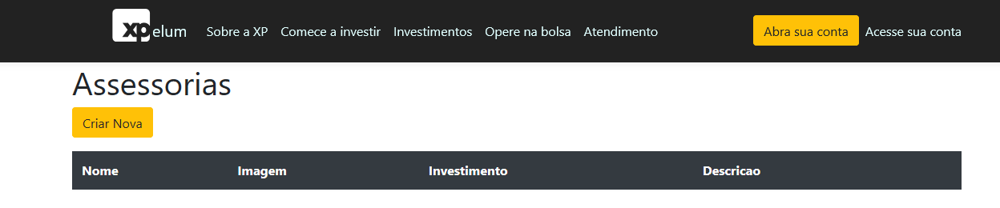
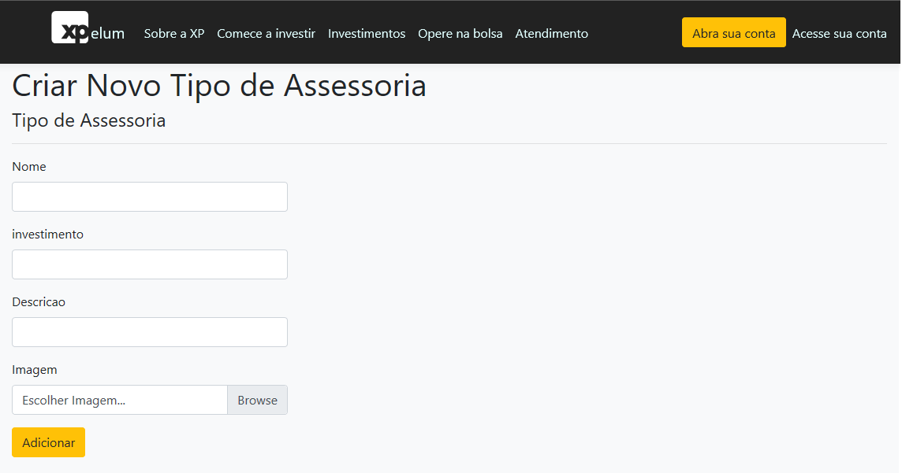

# O motivo de não passarmos direto uma ViewModel para seu o componente de upload ou para a sua classe de dominio

Atualmente estou desenolvendo um projeto prático com ASP.NET Core para melhorar e aprofundar meus conhecimentos nesse ecossistema que é realmente "fascinante". O Projeto trata-se de uma corretora - XPelum. E como o nome do projeto mostra, sim, é uma "imitação barata" do site da XP Investimentos (Hahaha).

Vamos ter uma série de posts no decorrer do projeto, sobre falhas, acertos e alguns pontos que acharmos interessante escrever. Nesse primeiro post vou mostrar o porque de não passarmos direto uma ViewModel para seu o componente de upload ou para a sua classe de dominio.

Para não ficar algo muito vago esse assunto, primeiramente vou contextualizar como comecei o desenvolvimento da XPelum e ai sim vamos entender o porque desse post. Espero não ser muito massante da descrição do projeto.

Então vamos lá...

---

## IDE, Ferramentas e Template

Esse projeto está sendo criado com .NET Core, ASP.NET Core 2.2 e usando o Visual Studio 2019.

O Template do projeto é ASP.NET Core Web Application (MVC). Já iniciei o projeto com Autenticação usando o Identity, mesmo não sendo necessário no Momento.


---

## ISSUE 1 - Tela Inicial - Home da XPelum

Esse projeto inicialmente está divido em 6 fases. A primeira implementação é criar a Home Page da XPelum seguindo como exemplo a página incial do Site da XP Investimentos (<https://www.xpi.com.br>).

A única observação para essa demanda é que teremos uma área de informação que será dinâmica - A área de Assessorias. Ou seja, essa parte não terá um html fixo. Irá alterar-se de acordo com a quantidade de Tipos de Assessorias existentes na Corretora.


### Inicio do Desenvolvimento - Criação da Tela Estática

A primeira coisa que comecei criando foi a tela de forma estática tentando ser o mais fiel possivel. Até mesmo área de Tipos de Assessoria eu deixei estatica. Para facilitar o desenvolvimento do código da tela, utilizei o Bootstrap, que já implementado por padrão do ASP.NET Core.

A tela foi crida dentro da Pasta "Home" que está dentro da Pasta Views (XPelum/Views/Home/Index.cshtml).

```csharp
//index.cshtml

@{
    ViewData["Title"] = "Home Page";
}
<div class="text-light bg-dark luciano-hulk row carousel">
    <div class="container">
        <div class="row mt-banner-2">
            <div class="col-6 align-self-center">
                
                <button class="btn btn-warning mt-3 centralizado ml-5 text-uppercase">Invista em Previdência</button>
            </div>
            <div class="col-6 form-luciano">
                <form class="form-group" action="/" method="post">
                    <input class="form-control" type="text" name="name" value="" placeholder="Nome" /> <br />
                    <input class="form-control" type="email" name="name" value="" placeholder="Email" /> <br />
                    <input class="btn btn-primary" type="submit" name="name" value="Abra sua conta" />
                </form>
            </div>
        </div>
    </div>
</div>

<div class="bg-light ">
    <div class="container">
        <div class="row pt-5 pb-5">
            <div class="col-4">
                <h2>Assessoria <br /> especializada</h2>
                <p>Independente do seu perfil, na XP você conta com uma assessoria de investimentos especializada de verdade.</p>
            </div>
            <div class="col-4">
                <h2>Taxa Zero</h2>
                <p>Esqueça as taxas mensais do banco. A XP oferece taxa zero para abertura e manutenção de conta.</p>
            </div>
            <div class="col-4">
                <h2>Portfólio completo</h2>
                <p>Na XP, você tem acesso a investimentos que nunca imaginou, por meio de um dos maiores portfólios de produtos do mercado.</p>
            </div>
        </div>
    </div>
</div>

<div class="bg-cinza">
    <div class="container">
        <div class="row">
            <div class="col-7 pt-5 pb-5">
                <h2>Conheça o Portal de Clientes da XP.</h2>
                <h4>Uma nova experiência criada para um novo jeito de investir</h4>
                <ul>
                    <li>Tenha uma visão geral de todos os seus investimentos em uma única tela.</li>
                    <li>Veja recomendações de produtos adequados ao seu perfil de investidor.</li>
                    <li>Acompanhe a performance e o histórico de suas aplicações de maneira simples e intuitiva.</li>
                </ul>
                <button class="btn btn-outline-warning text-dark">Acesse o Portal</button>
            </div>
            <div class="col-5">
                <iframe width="450" height="315" src="https://www.youtube.com/embed/PmDNlm6nMgQ" frameborder="0" allow="accelerometer; autoplay; encrypted-media; gyroscope; picture-in-picture" allowfullscreen></iframe>
            </div>
        </div>
    </div>
</div>

<div class="bg-white">
    <div class="container">
        <div class="row pt-5">
            <div class="col-5 pl-5">
                
            </div>
            <div class="col-7">
                <p>
                    Na XP, você não paga nada para abrir e manter sua conta e tem isenção de taxas para custódia de Renda Fixa, custódia de Bolsa, custódia de COE, Tesouro Direto (taxa XP) e tarifas de TED para retiradas. Mais do que um diferencial, isso é reflexo do nosso compromisso com a transparência e com os resultados dos nossos clientes.
                </p>
                <button class="btn btn-outline-warning text-dark">Saiba Mais</button>
            </div>
        </div>
    </div>
</div>

<div class="bg-white">
    <div class="container">
        <div class="row mt-3">
            <div class="col-12">
                <p class="text-center mt-5">RELACIONAMENTO XP</p>
                <h4 class="text-center">Atendimento transparente, próximo e do seu jeito: <br />aqui chamamos isso de assessoria de investimentos.</h4>
            </div>

            @*private*@
            <div class="col-md-3 mt-4 card meu-card">
                
                <h3 class="display-3">Assessoria <br /> Private</h3>
                <div>
                    <p class="mt-5">
                        A partir de R$<span class="valor-investimento">10 milhões</span> <br />
                        em investimentos
                    </p>
                </div>
                <div class="mt-2">
                    <p>Equipe altamente especializada e soluções sob medida.</p>
                </div>
                <div class="btn-investimento">
                    <button class="btn btn-outline-warning text-dark mb-3 ">Saiba mais</button>
                </div>
            </div>

            @*exclusiva*@
            <div class="col-md-3 mt-4 card meu-card">
                
                <h3 class="display-3">Assessoria <br /> Exclusiva</h3>
                <div>
                    <p class="mt-5">
                        A partir de R$<span class="valor-investimento">300 mil</span> <br />
                        em investimentos
                    </p>
                </div>
                <div class="mt-2 mb-5">
                    <p>Relacionamento próximo, acompanhamento individual e carteira de investimentos personalizada.</p>
                </div>
                <div class="btn-investimento">
                    <button class="btn btn-outline-warning text-dark mb-3">Saiba mais</button>
                </div>
            </div>

            @*OnDemand*@
            <div class="col-md-3 mt-4 card meu-card">
                
                <h3 class="display-3">Assessoria <br /> On Demand</h3>
                <div>
                    <p class="mt-5">
                        Entre R$<span class="valor-investimento">50 - 300 mil</span> <br />
                        em investimentos
                    </p>
                </div>
                <div class="mt-2">
                    <p>O melhor da experiência XP em um formato ágil e dinâmico.</p>
                </div>
                <div class="btn-investimento">
                    <button class="btn btn-outline-warning text-dark mb-3">Saiba mais</button>
                </div>
            </div>

            @*acessoria digital*@
            <div class="col-md-3 mt-4 card meu-card">
                
                <h3 class="display-3">Assessoria <br /> Digital</h3>

                <div>
                    <p class="mt-5">
                        Até R$<span class="valor-investimento">50 mil</span> <br />
                        em investimentos
                    </p>
                </div>
                <div class="mt-2">
                    <p>A porta de entrada para uma nova relação com os seus investimentos.</p>
                </div>
                <div class="btn-investimento">
                    <button class="btn btn-outline-warning text-dark mb-3">Saiba mais</button>
                </div>
            </div>
        </div>
    </div>
</div>
```

Para essa view ser chamada, é necessário termos uma **Controller**. Como nossa View está no diretório *XPelum/Views/Home/Index.cshtml*, teremos que ter uma pasta **Controllers** que possua um arquivo **HomeController.cs** com uma action **Index**.

```csharp
//HomeController.cs

namespace XPelum.Controllers
{
    public class HomeController : Controller
    {
        public IActionResult Index()
        {
            return View();
        }
        ...
    }
}
```

### Criando a entidade Assessoria

Como solicitado, teremos á area de Assessoria sendo Dinâmica. Pensando nisso, comecei a criar uma Model para representar os tipos de Assessoria.

Dentro da Pasta **Models** eu crie uma nova classe **Assessoria.cs**. Para representar uma Assessoria eu criei as propriedades *Id, Nome, Imagem, Investimento e Descriçao*. Além das propriedades, também criei um construtor recebendo uma ViewModel (CreateAssessoriaViewModel) e o caminho da imagem.

```csharp
//Assessoria.cs

namespace XPelum.Models
{
    public class Assessoria
    {
        public Assessoria()
        {

        }

        public Assessoria(CreateAssessoriaViewModel assessoriaVM, string uniqueFileName)
        {
            Nome = assessoriaVM.Nome;
            Imagem = uniqueFileName;
            Investimento = assessoriaVM.investimento;
            Descricao = assessoriaVM.Descricao;
        }

        public int Id { get; private set; }
        public string Nome { get; private set; }
        public string Imagem { get; private set; }
        public string Investimento { get; private set; }
        public string Descricao { get; private set; }

    }
}
```

Falaremos mais a frente que receber uma ViewModel na nossa classe de domínio não é interessante. Vamos entender o porque mais a frente. Até que estou apenas mostrando como fui pensando no desenvolvimento da aplicação.

### Criando a ViewModel

Acabamos de ver que utilizei o padrão ViewModel para criação de uma Assessoria. Para isso, foi criado uma pasta **ViewModel** e dentro dessa pasta uma classe **CreateAssessoriaViewModel.cs**.

```csharp
//CreateAssessoriaViewModel.cs

namespace XPelum.ViewModel
{
    public class CreateAssessoriaViewModel
    {
        [Required(ErrorMessage = "O campo {0} é obrigatório")]
        [StringLength(100, ErrorMessage = "O campo {0} precisa ter entre {2} e {1} caracteres", MinimumLength = 2)]
        public string Nome { get; set; }

        [Required(ErrorMessage = "O campo {0} é obrigatório")]
        public IFormFile Imagem { get; set; }

        [Required(ErrorMessage = "O campo {0} é obrigatório")]
        [StringLength(1000, ErrorMessage = "O campo {0} precisa ter entre {2} e {1} caracteres", MinimumLength = 2)]
        public string investimento { get; set; }

        [Required(ErrorMessage = "O campo {0} é obrigatório")]
        [StringLength(1000, ErrorMessage = "O campo {0} precisa ter entre {2} e {1} caracteres", MinimumLength = 2)]
        public string Descricao { get; set; }
    }
}
```

Além de usarmos os campos necessários para criar uma Assessoria, também foi criado as validações na ViewModel, deixando a Classe de Domínio mais "limpa".

### Criando Tabelas do Banco de Dados

Sabendo que vamos ter uma tabela no banco de dados para a Entidade Assessoria, primeiramente precisamos mapea-la. Foi usado o Fluent Api para isso. 

Criei dentro da pasta **Data** uma nova pasta **Map** e a classe **AssessoriaMapping.cs**.

```csharp
//AcessoriaMapping.cs

namespace XPelum.Data.Map
{
    public class AcessoriaMapping : IEntityTypeConfiguration<Assessoria>
    {
        public void Configure(EntityTypeBuilder<Assessoria> builder)
        {
            //builder.HasKey(p => p.Id);

            builder.Property(p => p.Nome)
                .IsRequired()
                .HasColumnType("varchar(100)");

            builder.Property(p => p.Investimento)
                .IsRequired()
                .HasColumnType("varchar(1000)");

            builder.Property(p => p.Descricao)
                .IsRequired()
                .HasColumnType("varchar(1000)");

            builder.Property(p => p.Imagem)
                .IsRequired();
        }
    }
}
```

### Criando DbContext

Como estamos usando o ORM Entity Framework, é necessário criarmos nosso DbContext, para mapearmos as classes de dominio para tabelas do Banco de Dados. Dentro da Pasta **Data** criei a classe **MeuDbContext**.

```csharp
//MeuDbContext.cs

namespace XPelum.Data
{
    public class MeuDbContext : DbContext
    {
        public MeuDbContext(DbContextOptions<MeuDbContext> options) : base(options)
        {
        }

        public DbSet<Assessoria> Assessoria { get; set; }

        protected override void OnModelCreating(ModelBuilder builder)
        {
            builder.ApplyConfigurationsFromAssembly(typeof(MeuDbContext).Assembly); //para classes de mapping (fluent Api)
        }
    }
}
```
### Criando Repositorio

Antes de criarmos o Controlador de Assessoria, criei o Repositório, que tem acesso ao DbContext e métodos que serão reaproveitados na Controller. Criei uma Pasta **Repository** e a classe **AssessoriaRepository**.

```csharp
//AssessoriaRepository.cs

namespace XPelum.Repository
{
    public class AssessoriaRepository
    {

        private readonly MeuDbContext _context;
        public AssessoriaRepository(MeuDbContext context)
        {
            _context = context;
        }

        public IEnumerable<Assessoria> ListarTodas()
        {
            return _context.Assessoria.ToList();
        }

        public void Salvar(Assessoria assessoria)
        {
            _context.Add(assessoria);
            _context.SaveChanges();
        }
    }
} 
```
### Criando AssessoriaController

Dento da pasta **Controllers** criei a classe **AssessoriasController.cs**.

```csharp
//AssessoriasController.cs

namespace XPelum.Controllers
{
    public class AssessoriasController : Controller
    {
        private readonly AssessoriaRepository _repository;
        private readonly IHostingEnvironment _hostingEnvironment;

        public AssessoriasController(AssessoriaRepository repository,
                                    IHostingEnvironment hostingEnvironment)
        {
            _repository = repository;
            _hostingEnvironment = hostingEnvironment;
        }

        // GET: Acessorias
        public IActionResult Index()
        {
            return View(_repository.ListarTodas());
        }

        public IActionResult Create()
        {
            return View();
        }

        [HttpPost]
        [ValidateAntiForgeryToken]
        public IActionResult Create(CreateAssessoriaViewModel acessoriaVM)
        {
            if (ModelState.IsValid)
            {
                string uniqueFileName = null;  
                if(acessoriaVM.Imagem != null)
                {
                    //usando a factory para salvar imagem
                    var uploadImage = new UploadImageFactory(_hostingEnvironment);
                    uniqueFileName = uploadImage.SalvarImagem(acessoriaVM);
                }

                var acessoria = new Assessoria(acessoriaVM, uniqueFileName);

                _repository.Salvar(acessoria);
                return RedirectToAction(nameof(Index));
            }
            return View(acessoriaVM);
        }

    }
}
```

Note na criação de uma Assessoria, no método Put estou passando como parametro a ViewmoModel para o UploadImage. Esse é um assunto que trateremos mais a frente por não ser algo adequado.

### Criando a classe de Upload de Imagem

Inicialmente eu tratei essa classe como uma "Factory". Mas mudei para Component.

```csharp
//UploadImageFactory.cs
namespace XPelum.Factory
{
    public class UploadImageFactory
    {
        private readonly IHostingEnvironment _hostingEnvironment;
        public UploadImageFactory(IHostingEnvironment hostingEnvironment)
        {
            _hostingEnvironment = hostingEnvironment;          
        }

        public string SalvarImagem(CreateAssessoriaViewModel assessoriaVM)
        {
            string pasta = Path.Combine(_hostingEnvironment.WebRootPath, "img"); //determina o diretório para salvar as imagens
            var uniqueFileName = Guid.NewGuid().ToString() + "_" + assessoriaVM.Imagem.FileName; //criando um unico nome de imagem com GUID
            string diretorioDaImagem = Path.Combine(pasta, uniqueFileName); //combinando diretório da pasta com nome da imagem
            assessoriaVM.Imagem.CopyTo(new FileStream(diretorioDaImagem, FileMode.Create));

            return uniqueFileName;
        }
    }
}
```
Como falei anteriormente, a classe recebe no contrutor a CreateAssessoriaViewModel, que não é ideal. Posteriormente iremos falar sobre esse mal cheiro.

### Criando as View de Assessoria.

Inicialmente criei duas Views para Assessoria. Foram criadas as Views **Index** e **Create** dentro do diretório **/Views/Assessorias/**.

```csharp
//Index.cshtml.cs

@model IEnumerable<XPelum.Models.Assessoria>

@{
    ViewData["Title"] = "Assessorias";
}

    <div class="container">
        <h1>@ViewData["Title"]</h1>

        <p>
            <a class="btn btn-warning" asp-action="Create">Criar Nova</a>
        </p>
        <table class="table table-hover table-light">
            <thead class="table-dark">
                <tr>
                    <th>
                        @Html.DisplayNameFor(model => model.Nome)
                    </th>
                    <th>
                        @Html.DisplayNameFor(model => model.Imagem)
                    </th>
                    <th>
                        @Html.DisplayNameFor(model => model.Investimento)
                    </th>
                    <th>
                        @Html.DisplayNameFor(model => model.Descricao)
                    </th>
                    <th></th>
                </tr>
            </thead>
            <tbody>
                @foreach (var item in Model)
                {
                    <tr>
                        <td>
                            @Html.DisplayFor(modelItem => item.Nome)
                        </td>
                        <td>
                             item.Imagem)" alt="Imagem da Acesoria" style=" height: 100px; width:auto" />
                        </td>
                        <td>
                            @Html.DisplayFor(modelItem => item.Investimento)
                        </td>
                        <td>
                            @Html.DisplayFor(modelItem => item.Descricao)
                        </td>
                    </tr>
                }
            </tbody>
        </table>
    </div> 
```

#### Index


```csharp
//Create.cshtml

@model XPelum.ViewModel.CreateAssessoriaViewModel

@{
    ViewData["Title"] = "Criar Novo Tipo de Assessoria";
}
    <div class="container bg-light">
        <h1>@ViewData["Title"]</h1>

        <h4>Tipo de Assessoria</h4>
        <hr />
        <div class="row">
            <div class="col-md-4">
                <form asp-action="Create" enctype="multipart/form-data" method="post">
                    <div asp-validation-summary="ModelOnly" class="text-danger"></div>
                    <div class="form-group">
                        <label asp-for="Nome" class="control-label"></label>
                        <input asp-for="Nome" class="form-control" />
                        <span asp-validation-for="Nome" class="text-danger"></span>
                    </div>

                    <div class="form-group">
                        <label asp-for="investimento" class="control-label"></label>
                        <input asp-for="investimento" class="form-control" />
                        <span asp-validation-for="investimento" class="text-danger"></span>
                    </div>
                    <div class="form-group">
                        <label asp-for="Descricao" class="control-label"></label>
                        <input asp-for="Descricao" class="form-control" />
                        <span asp-validation-for="Descricao" class="text-danger"></span>
                    </div>

                    <div class="form-group">
                        <label asp-for="Imagem" class="control-label"></label>
                        <div>
                            <div class="custom-file">
                                <input asp-for="Imagem" class="form-control custom-file-input" />
                                <label class="custom-file-label">Escolher Imagem...</label>
                            </div>
                        </div>
                        <span asp-validation-for="Descricao" class="text-danger"></span>
                    </div>

                    <div class="form-group">
                        <input type="submit" value="Adicionar" class="btn btn-warning" />
                    </div>
                </form>
            </div>
        </div>

        <div>
            <a asp-action="Index">Back to List</a>
        </div>
    </div>
@section Scripts {
    @{await Html.RenderPartialAsync("_ValidationScriptsPartial");}
    <script>
        $(document).ready(function () {
            $('.custom-file-input').on("change", function () {
                var fileName = $(this).val().split("\\").pop();
                $(this).next('.custom-file-label').html(fileName);
            });
        });
    </script>
}
```
#### Create


### Tornando a área de Assessoria Dinâmica.

Com a criação dos tipos de assessorias disponíveis, já podemos tornar a área dos Tipos de Assessoria da **Index** da **Home** *dinâmica*.

```csharp
//index.cshtml

@model IEnumerable<XPelum.Models.Assessoria>

@*@{
    ViewData["Title"] = "Home Page";
}*@
<div class="text-light bg-dark luciano-hulk row carousel">
    <div class="container">
        <div class="row mt-banner-2">
            <div class="col-6 align-self-center">
                
                <button class="btn btn-warning mt-3 centralizado ml-5 text-uppercase">Invista em Previdência</button>
            </div>
            <div class="col-6 form-luciano">
                <form class="form-group" action="/" method="post">
                    <input class="form-control" type="text" name="name" value="" placeholder="Nome" /> <br />
                    <input class="form-control" type="email" name="name" value="" placeholder="Email" /> <br />
                    <input class="btn btn-primary" type="submit" name="name" value="Abra sua conta" />
                </form>
            </div>
        </div>
    </div>
</div>

<div class="bg-light ">
    <div class="container">
        <div class="row pt-5 pb-5">
            <div class="col-4">
                <h2>Assessoria <br /> especializada</h2>
                <p>Independente do seu perfil, na XP você conta com uma assessoria de investimentos especializada de verdade.</p>
            </div>
            <div class="col-4">
                <h2>Taxa Zero</h2>
                <p>Esqueça as taxas mensais do banco. A XP oferece taxa zero para abertura e manutenção de conta.</p>
            </div>
            <div class="col-4">
                <h2>Portfólio completo</h2>
                <p>Na XP, você tem acesso a investimentos que nunca imaginou, por meio de um dos maiores portfólios de produtos do mercado.</p>
            </div>
        </div>
    </div>
</div>

<div class="bg-cinza">
    <div class="container">
        <div class="row">
            <div class="col-7 pt-5 pb-5">
                <h2>Conheça o Portal de Clientes da XP.</h2>
                <h4>Uma nova experiência criada para um novo jeito de investir</h4>
                <ul>
                    <li>Tenha uma visão geral de todos os seus investimentos em uma única tela.</li>
                    <li>Veja recomendações de produtos adequados ao seu perfil de investidor.</li>
                    <li>Acompanhe a performance e o histórico de suas aplicações de maneira simples e intuitiva.</li>
                </ul>
                <button class="btn btn-outline-warning text-dark">Acesse o Portal</button>
            </div>
            <div class="col-5">
                <iframe width="450" height="315" src="https://www.youtube.com/embed/PmDNlm6nMgQ" frameborder="0" allow="accelerometer; autoplay; encrypted-media; gyroscope; picture-in-picture" allowfullscreen></iframe>
            </div>
        </div>
    </div>
</div>

<div class="bg-white">
    <div class="container">
        <div class="row pt-5">
            <div class="col-5 pl-5">
                
            </div>
            <div class="col-7">
                <p>
                    Na XP, você não paga nada para abrir e manter sua conta e tem isenção de taxas para custódia de Renda Fixa, custódia de Bolsa, custódia de COE, Tesouro Direto (taxa XP) e tarifas de TED para retiradas. Mais do que um diferencial, isso é reflexo do nosso compromisso com a transparência e com os resultados dos nossos clientes.
                </p>
                <button class="btn btn-outline-warning text-dark">Saiba Mais</button>
            </div>
        </div>
    </div>
</div>


<div class="bg-white">
    <div class="container">
        <div class="row mt-3">

            @foreach (var item in Model)
            {
                <div class="col-md-3 mt-4 card meu-card">
                     item.Imagem)" alt="Acessoria Private" />
                    <h3 class="display-3">Assessoria <br /> @Html.DisplayFor(modelItem => item.Nome)</h3>
                    <div>
                        <p class="mt-5 font-weight-bold">
                            @Html.DisplayFor(modelItem => item.Investimento)
                        </p>
                    </div>
                    <div class="mt-2 mb-5">
                        <p>@Html.DisplayFor(modelItem => item.Descricao)</p>
                    </div>
                    <div class="btn-investimento mt-5">
                        <button class="btn btn-outline-warning text-dark mb-3 ">Saiba mais</button>
                    </div>
                </div>
            }
        </div>
    </div>
</div>
```

---

## Code Review

Após a conclusão dessa "feature" e passar por um "code review" do meu chefe (Alberto), tive que realizar algumas refatorações. Iremos focar apenas em duas: ***O motivo de não passarmos direto uma ViewModel para seu o componente de upload ou para a sua classe de dominio***

Da forma que fiz inicialmente, estou passando a ViewModel tanto para a classe de dominio quanto para o componente de Upload. Qualquer alteração na ViewModel irá afetar as classes "dependentes". 

```csharp
//AssessoriasController.cshtml

        ...
        [HttpPost]
        [ValidateAntiForgeryToken]
        public IActionResult Create(CreateAssessoriaViewModel acessoriaVM)
        {
            if (ModelState.IsValid)
            {
                string uniqueFileName = null;  
                if(acessoriaVM.Imagem != null)
                {
                    //usando a factory para salvar imagem
                    var uploadImage = new UploadImageFactory(_hostingEnvironment);
                    uniqueFileName = uploadImage.SalvarImagem(acessoriaVM);
                }

                var acessoria = new Assessoria(acessoriaVM, uniqueFileName);

                _repository.Salvar(acessoria);
                return RedirectToAction(nameof(Index));
            }
            return View(acessoriaVM);
        }
        ...
```
Como sabemos e repetimos como um mantra, na Orientação a Objetos um bom código possui alta coesão e baixo acoplamento. Da forma que está atualmente, temos um acoplamento "perigoso" nessas classes.

Outro ponto que podemos citar é que nosso componente possui a responsabilidade de receber uma imagem e realizar o upload. Antes da revisão ele dependia da ViewModel. Dessa forma não era 100% reaproveitavel.

Vamos agora realizar a revisão do código, tirando esse acoplamento e deixando o componente de upload reaproveitavel.

### Ajustando a Classe de Dominio

```csharp
//Assessoria.cshtml
namespace XPelum.Models
{
    public class Assessoria
    {
        public Assessoria(string nome, string imagem, string investimento, string descricao)
        {
            Nome = nome;
            Imagem = imagem;
            Investimento = investimento;
            Descricao = descricao;
        }

        public int Id { get; private set; }
        public string Nome { get; }
        public string Imagem { get; }
        public string Investimento { get; }
        public string Descricao { get; }

    }
}
```

No que agora não dependemos mais de uma ViewModel para a construção de uma Assessoria. Estou recebendo como parâmetros no construtor somente o que nos interessa realmente.

### Ajustando o Componente de Upload de Imagem

Se você voltar no código verá que antes era uma Factory. porém foi alterado para Component.

```csharp
//UploadImageComponent.cshtml

namespace XPelum.Components
{
    public class UploadImageComponent
    {
        private readonly IHostingEnvironment _hostingEnvironment;
        public UploadImageComponent(IHostingEnvironment hostingEnvironment)
        {
            _hostingEnvironment = hostingEnvironment;          
        }

        public string SalvaImagem(IFormFile Imagem)
        {
            string pasta = Path.Combine(_hostingEnvironment.WebRootPath, "img"); //determina o diretório para salvar as imagens
            var uniqueFileName = Guid.NewGuid().ToString() + "_" + Imagem.FileName; //criando um unico nome de imagem com GUID
            string diretorioDaImagem = Path.Combine(pasta, uniqueFileName); //combinando diretório da pasta com nome da imagem
            Imagem.CopyTo(new FileStream(diretorioDaImagem, FileMode.Create));

            return uniqueFileName;
        }
    }
}
```

Agora nossa classe de Upload de Imagem esta recebendo como parâmetro do Construtor um IFormFile, que dana mais é que um tipo que representa nossa Imagem. Não depende mais de uma ViewModel.

### Ajustando a Controller

Além das classes alteradas acima, também é necessário alterar onde elas eram utilizadas. Nesse casso na classe **AssessoriasController.cs**.

```csharp
//AssessoriasController.cshtml

        ...
        [HttpPost]
        [ValidateAntiForgeryToken]
        public IActionResult Create(CreateAssessoriaViewModel assessoriaVM)
        {
            if (ModelState.IsValid)
            {
                var uploadImage = new UploadImageComponent(_hostingEnvironment);
                var uniqueFileName = uploadImage.SalvaImagem(assessoriaVM.Imagem);

                var assessoria = new Assessoria(assessoriaVM.Nome, uniqueFileName, assessoriaVM.investimento, assessoriaVM.Descricao);

                _repository.Salvar(assessoria);
                return RedirectToAction(nameof(Index));
            }
            return View(assessoriaVM);
        }
```

Agora, ao instanciarmos as classes UploadImageComponent e Assessoria não passamos mais a ViewModel como parâmetro. Passamos somente o que é necessário para elas serem criadas. Ou seja, não há mais o acoplamento da ViewModel.

---

## Conclusão

Ainda há muito para ser feito nessa aplpicação. Mas já notei uma certa evolução técnica no meu desenvolvimento e no entendimento de um projeto. Ainda sim, alguns pontos "básicos" precisam ser melhorados, como no mal cheiro criado ao passar uma ViewModel para a classe de Domínio e para o componente de Upload de Imagem.
Acredito que com o decorrer do projeto irei acertar e errar, mas com certeza estarei melhor do que agora.
