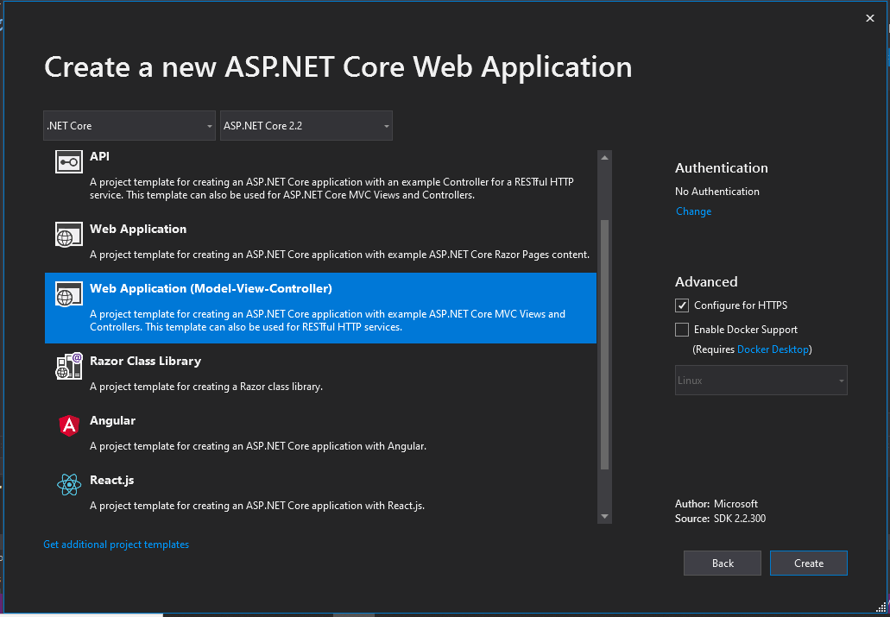

# O motivo de não passarmos direto uma ViewModel para seu o componente de upload ou para a sua classe de dominio

Atualmente estou desenolvendo um projeto prático com ASP.NET Core para melhorar e aprofundar meus conhecimentos nesse ecossistema que é realmente "fascinante". O Projeto trata-se de uma corretora - XPelum. E como o nome do projeto mostra, sim, é uma "imitação barata" do site da XP Investimentos (Hahaha).

Vamos ter uma série de posts no decorrer do projeto, sobre falhas, acertos e alguns pontos que acharmos interessante escrever. Nesse primeiro post vou mostrar o porque de não passarmos direto uma ViewModel para seu o componente de upload ou para a sua classe de dominio.

Para não ficar algo muito vago esse assunto, primeiramente vou contextualizar como comecei o desenvolvimento da XPelum e ai sim vamos entender o porque desse post. Espero não ser muito massante da descrição do projeto.

Então vamos lá...

---

## IDE, Ferramentas e Template

Esse projeto está sendo criado com .NET Core, ASP.NET Core 2.2 e usando o Visual Studio 2019.

O Template do projeto é ASP.NET Core Web Application (MVC). Já iniciei o projeto com Autenticação usando o Identity, mesmo não sendo necessário no Momento.



---

## ISSUE 1 - Tela Inicial - Home da XPelum

Esse projeto inicialmente está divido em 6 fases. A primeira implementação é criar a Home Page da XPelum seguindo como exemplo a página incial do Site da XP Investimentos (<https://www.xpi.com.br>).

A única observação para essa demanda é que teremos uma área de informação que será dinâmica - A área de Assessorias. Ou seja, essa parte não terá um html fixo. Irá alterar-se de acordo com a quantidade de Tipos de Assessorias existentes na Corretora.


### Inicio do Desenvolvimento - Criação da Tela Estática

A primeira coisa que comecei criando foi a tela de forma estática tentando ser o mais fiel possivel. Até mesmo área de Tipos de Assessoria eu deixei estatica. Para facilitar o desenvolvimento do código da tela, utilizei o Bootstrap, que já implementado por padrão do ASP.NET Core.

A tela foi crida dentro da Pasta "Home" que está dentro da Pasta Views (XPelum/Views/Home/Index.cshtml).

```csharp
//index.cshtml

@{
    ViewData["Title"] = "Home Page";
}
<div class="text-light bg-dark luciano-hulk row carousel">
    <div class="container">
        <div class="row mt-banner-2">
            <div class="col-6 align-self-center">
                
                <button class="btn btn-warning mt-3 centralizado ml-5 text-uppercase">Invista em Previdência</button>
            </div>
            <div class="col-6 form-luciano">
                <form class="form-group" action="/" method="post">
                    <input class="form-control" type="text" name="name" value="" placeholder="Nome" /> <br />
                    <input class="form-control" type="email" name="name" value="" placeholder="Email" /> <br />
                    <input class="btn btn-primary" type="submit" name="name" value="Abra sua conta" />
                </form>
            </div>
        </div>
    </div>
</div>

<div class="bg-light ">
    <div class="container">
        <div class="row pt-5 pb-5">
            <div class="col-4">
                <h2>Assessoria <br /> especializada</h2>
                <p>Independente do seu perfil, na XP você conta com uma assessoria de investimentos especializada de verdade.</p>
            </div>
            <div class="col-4">
                <h2>Taxa Zero</h2>
                <p>Esqueça as taxas mensais do banco. A XP oferece taxa zero para abertura e manutenção de conta.</p>
            </div>
            <div class="col-4">
                <h2>Portfólio completo</h2>
                <p>Na XP, você tem acesso a investimentos que nunca imaginou, por meio de um dos maiores portfólios de produtos do mercado.</p>
            </div>
        </div>
    </div>
</div>

<div class="bg-cinza">
    <div class="container">
        <div class="row">
            <div class="col-7 pt-5 pb-5">
                <h2>Conheça o Portal de Clientes da XP.</h2>
                <h4>Uma nova experiência criada para um novo jeito de investir</h4>
                <ul>
                    <li>Tenha uma visão geral de todos os seus investimentos em uma única tela.</li>
                    <li>Veja recomendações de produtos adequados ao seu perfil de investidor.</li>
                    <li>Acompanhe a performance e o histórico de suas aplicações de maneira simples e intuitiva.</li>
                </ul>
                <button class="btn btn-outline-warning text-dark">Acesse o Portal</button>
            </div>
            <div class="col-5">
                <iframe width="450" height="315" src="https://www.youtube.com/embed/PmDNlm6nMgQ" frameborder="0" allow="accelerometer; autoplay; encrypted-media; gyroscope; picture-in-picture" allowfullscreen></iframe>
            </div>
        </div>
    </div>
</div>

<div class="bg-white">
    <div class="container">
        <div class="row pt-5">
            <div class="col-5 pl-5">
                
            </div>
            <div class="col-7">
                <p>
                    Na XP, você não paga nada para abrir e manter sua conta e tem isenção de taxas para custódia de Renda Fixa, custódia de Bolsa, custódia de COE, Tesouro Direto (taxa XP) e tarifas de TED para retiradas. Mais do que um diferencial, isso é reflexo do nosso compromisso com a transparência e com os resultados dos nossos clientes.
                </p>
                <button class="btn btn-outline-warning text-dark">Saiba Mais</button>
            </div>
        </div>
    </div>
</div>

<div class="bg-white">
    <div class="container">
        <div class="row mt-3">
            <div class="col-12">
                <p class="text-center mt-5">RELACIONAMENTO XP</p>
                <h4 class="text-center">Atendimento transparente, próximo e do seu jeito: <br />aqui chamamos isso de assessoria de investimentos.</h4>
            </div>

            @*private*@
            <div class="col-md-3 mt-4 card meu-card">
                
                <h3 class="display-3">Assessoria <br /> Private</h3>
                <div>
                    <p class="mt-5">
                        A partir de R$<span class="valor-investimento">10 milhões</span> <br />
                        em investimentos
                    </p>
                </div>
                <div class="mt-2">
                    <p>Equipe altamente especializada e soluções sob medida.</p>
                </div>
                <div class="btn-investimento">
                    <button class="btn btn-outline-warning text-dark mb-3 ">Saiba mais</button>
                </div>
            </div>

            @*exclusiva*@
            <div class="col-md-3 mt-4 card meu-card">
                
                <h3 class="display-3">Assessoria <br /> Exclusiva</h3>
                <div>
                    <p class="mt-5">
                        A partir de R$<span class="valor-investimento">300 mil</span> <br />
                        em investimentos
                    </p>
                </div>
                <div class="mt-2 mb-5">
                    <p>Relacionamento próximo, acompanhamento individual e carteira de investimentos personalizada.</p>
                </div>
                <div class="btn-investimento">
                    <button class="btn btn-outline-warning text-dark mb-3">Saiba mais</button>
                </div>
            </div>

            @*OnDemand*@
            <div class="col-md-3 mt-4 card meu-card">
                
                <h3 class="display-3">Assessoria <br /> On Demand</h3>
                <div>
                    <p class="mt-5">
                        Entre R$<span class="valor-investimento">50 - 300 mil</span> <br />
                        em investimentos
                    </p>
                </div>
                <div class="mt-2">
                    <p>O melhor da experiência XP em um formato ágil e dinâmico.</p>
                </div>
                <div class="btn-investimento">
                    <button class="btn btn-outline-warning text-dark mb-3">Saiba mais</button>
                </div>
            </div>

            @*acessoria digital*@
            <div class="col-md-3 mt-4 card meu-card">
                
                <h3 class="display-3">Assessoria <br /> Digital</h3>

                <div>
                    <p class="mt-5">
                        Até R$<span class="valor-investimento">50 mil</span> <br />
                        em investimentos
                    </p>
                </div>
                <div class="mt-2">
                    <p>A porta de entrada para uma nova relação com os seus investimentos.</p>
                </div>
                <div class="btn-investimento">
                    <button class="btn btn-outline-warning text-dark mb-3">Saiba mais</button>
                </div>
            </div>
        </div>
    </div>
</div>
```

Para essa view ser chamada, é necessário termos uma **Controller**. Como nossa View está no diretório *XPelum/Views/Home/Index.cshtml*, teremos que ter uma pasta **Controllers** que possua um arquivo **HomeController.cs** com uma action **Index**.

```csharp
//HomeController.cs

namespace XPelum.Controllers
{
    public class HomeController : Controller
    {
        public IActionResult Index()
        {
            return View();
        }
        ...
    }
}
```

### Criando a entidade Assessoria

Como solicitado, teremos á area de Assessoria sendo Dinâmica. Pensando nisso, comecei a criar uma Model para representar os tipos de Assessoria.

