# Criando Registro e Login de Usuários de uma forma Segura

Ao ligarmos nosso computador, acessarmos nosso email ou tentarmos entrar em nossa conta do banco notamos algo em comum - A necessidade de autenticação.

Hoje em dia, ao navegarmos pelos sites e sistemas percebos que é algo muito comum as telas de Registro e Login de usuários. Ou seja, é algo rotineiro para o desenvolvimento de sistemas.

Pensando assim, supondo que somos desenvolvedores de software focado em .NET, e surgiu um novo trabalho ou uma nova demanda que é a criação de um sistema que precisa ter Autenticação, como faremos essa Autenticação?

Muitas vezes pode surgir a ideia de criarmos nossa Feature de Registro e Login na "mão". Ou seja, nós mesmos implementarmos criarmos todo o fluxo de registro e login de um usuário.

Mas será se essa seria a melhor escolha?

---

Como vimos, Autenticação de Usuario é um probelma recorrente na vida de Desenvolvedores. Quando temos situações assim, alguem provavelmente já desenvolveu algo para facilitar as nossas vidas.

Claro que criar uma Autenticação do zero não está errado, mas será muito trabalhoso e poderá existir brechas de segurança. Não que as soluções prontas não possuem brechas, mas são anos de maturidade, melhorando o código e tornando-se cada vez mais seguras, além da facilidade e velocida de serem implementadas nas aplicações.

Agora que decidimos que não iremos escrever a nossa Feature na mão (espero que tenha dado algums motivações haha), qual solução pronta iremos usar em nossa aplicação ASP.NET Core?

## ASP.NET Core Identity

Um framework muito utilizado pela comunidade .NET para autenticação é o ASP.NET Core Identity, ou simplemente Identity.

Além de ser uma solução segura pronta para podermos utilizarmos para termos nossas telas de Registro, Login, erros, etc, o Identity nos traz muitas facilidades como o envio de email para confirmação de registro, registro usando OAuth para usuarios poderem se conectarem por provedores externos (Facebook, Twitter, Google e Microsoft), entre outras que falaremos a adiante.

Mas nada melhor para aprender e entender melhor do que usar o Identity...

## Criando Projeto com o Identity

Esse projeto está sendo criado com .NET Core, ASP.NET Core 2.2 e usando o Visual Studio 2019.

O Template do projeto é ASP.NET Core Web Application (MVC). Já iniciei o projeto com Autenticação usando o Identity.

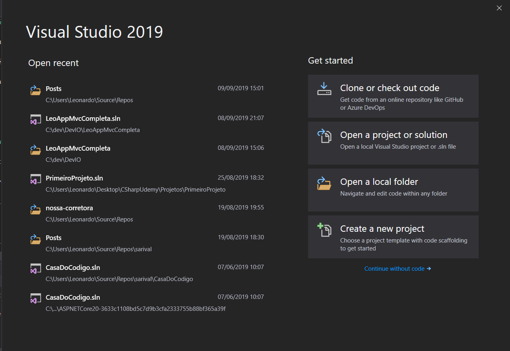

---

Ao Clicarmos em "Create a new Project" vamos para a seguinte tela, onde devemos selecionar "ASP.NET Core Web Applications e clicar em "next":

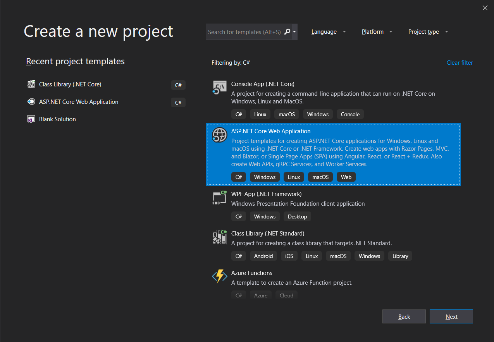

---

Nessa tela é onde definimos o Nome do nosso projeto, nome da Solução e o diretório onde será salvo. Clicamos em create para prosseguir:

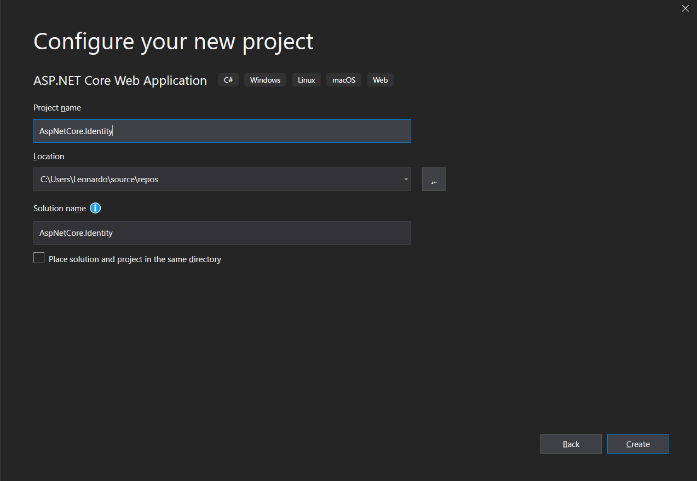

---

Na tela seguinte selecionamos o Template da aplicação, se terá Autorização, qual a versão do ASP.NET iremos utilizar. Primeiro Selecionamos que será ASP.NET Core 2.2 e o template - (MVC).

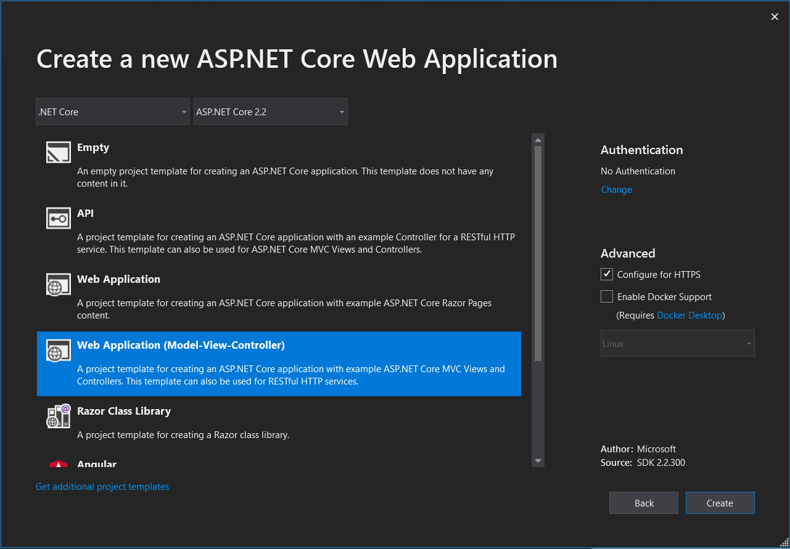

---

Ainda na mesma tela vamos mudar a opção de autenticação. Ao clicarmos em "change" abrirá aba mostrando as opções. Selecione "Individual user Account" clique em OK. Após isso clique em Create para gerar o novo projeto.

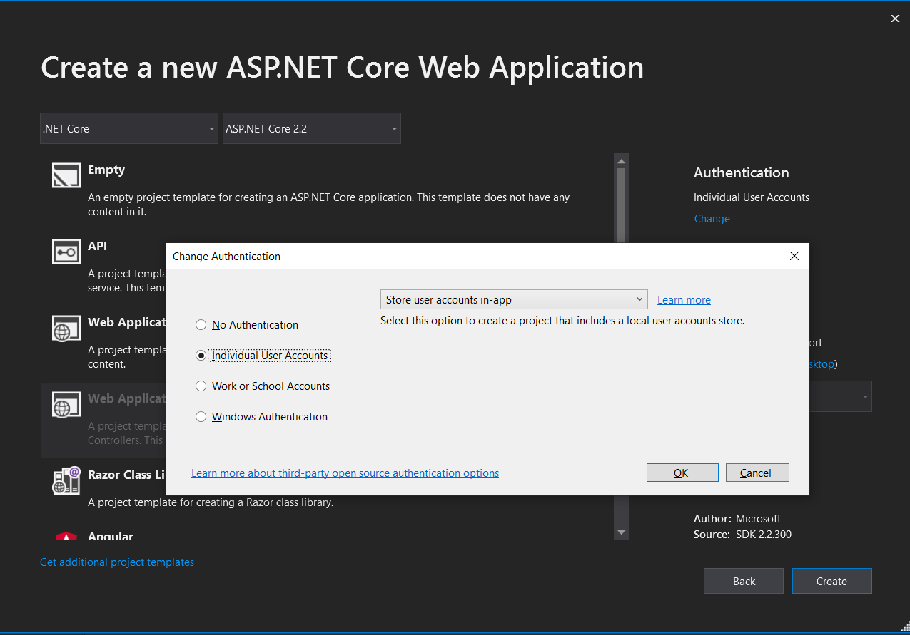

---

Após essa configuração inicial, nosso projeto está criado:

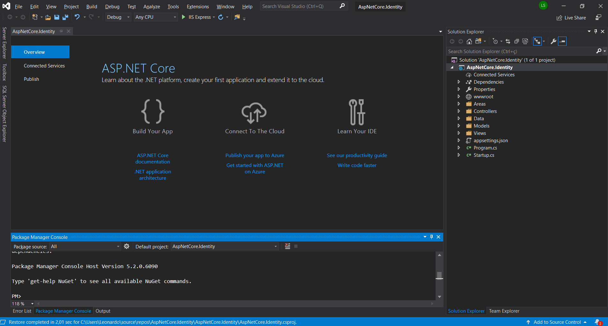

---

## Rodando o Projeto com o Identity

Ao executarmos o projeto, teremos a seguinte tela inicial:

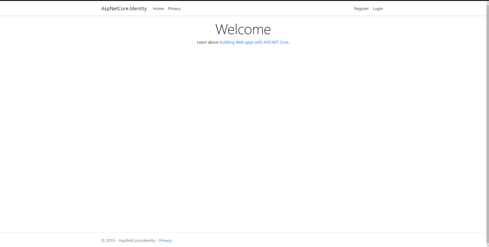

Note que no menu de Navegação temos os links para "Home", "Privacy", "Register" e "Login". Sendo que esses dois últimos foram criados pelo "Identity".

---

Clicando no Link "Register" seremos redirecionados para seguinte tela:

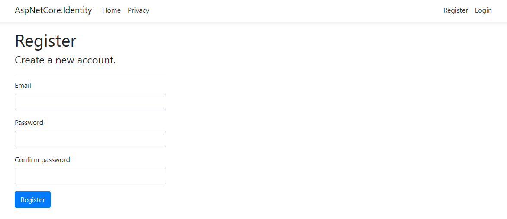

E clicando no Link "Login" seremos redirecionados para seguinte tela:

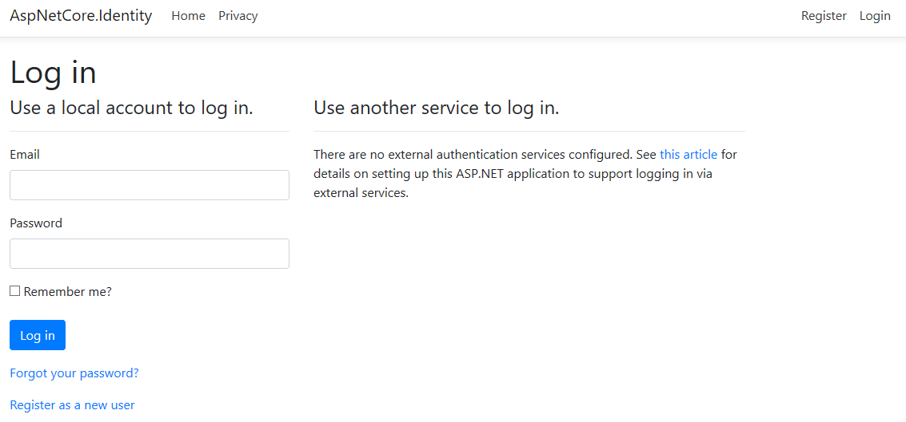

Note que não foi necessário criar nenhuma tela de Login e Registro para termos a Feature pronta. Isso nos auxilia muito tanto na velocidade de desenvolvimento como manutenção, pois é um Framework pronto que os Desenvolvedores .NET estão acostumados e familiarizados. Além de ser uma biblioteca com maturidade e segura.

Depois de darmos uma passada rápida na execução do Aplicação, vamos ver o que foi criado no nosso projeto. Focaremos no Identity.

---

## Conhecendo o Projeto com o Identity

### Arquivos novos

Ao criarmos um projeto com o Identity é possivel observar a criação de algumas pastas na arvore do projeto: "Areas" e "Data".

Dentro da pasta "Areas" temos uma pasta "Identity", que possue uma pasta "Pages", que por sua vez possue um arquivo "_ViewStart.cshtml".

Na pasta "Data" possuimos um arquivo "ApplicationDbContext.cs" que é o Contexto para a persistencia de dados com o Banco de Dados e uma pasta "Migration" com uma migration inicial para criação das tabelas.

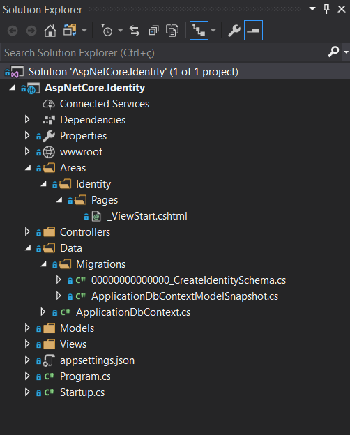

A classe "ApplicationDbContext.cs" é bem simples. Ela herda de "IdentityDbContext" e possue um construtor passando o DbContextOptions (configurações) para a classe base. 

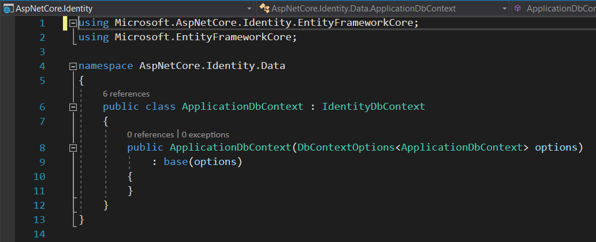

Os outros arquivos - "_ViewStart" apenas aponta para usar o Layout padrão do projeto e as migrations possuem um esquema de criação do Banco de Dados com as tabelas necessárias para o Iedntity.

---

### Appsettings.json e Startup.cs

Além dessas pastas e arquivos criados, o identity alterou alguns outros arquivos:

- No arquivo de configuração "appsettings.json" ele criou a ConnectionStrings padrão.

- Na classe "Startup.cs" no método "ConfigureServices" é adicionado o DbContext apontando para a ConnectionString e adicionado o iedntity. Já no metodo "Configure" é adicionado a Autenticação.

Arquivo appsettings.json:

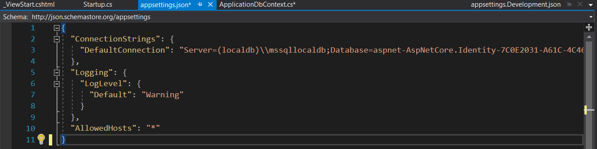

Arquivo Startup.cs, método "ConfigureServices":

Arquivo Startup.cs, método "Configure":

---

### Partial View

Além de todas essas alterações, o Identity utiliza uma Partial View para exibir no menu de navegação os links de "Register" e "login".

Esse arquivo é possivel ser localizado dentro do diretório "Views/Shared/_LoginPartial.cshtml".

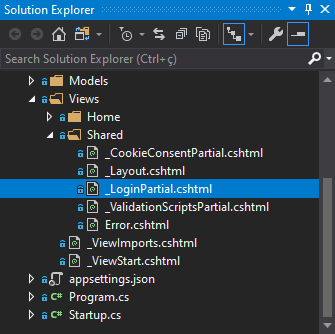

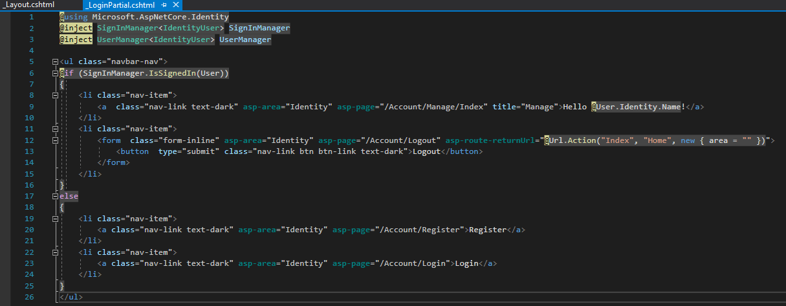

Essa Partial View utiliza o Identity (SignInManager e UserManager) realizando uma lógica verificando se o usuário está logado ou não.

 Caso não esteja, será mostrado os Links de "Register" e "link". Após o Usuário logar-se, no lugar dos links anteriores, será exibido o nome do usuário e um link para "Logout".

- Menu de navegação sem o usuário de autenticar:

- Menu de navegação com o usuário autenticado:

Um ponto importante que temos que mencionar é onde essa "_LoginPartial" está sendo referenciada.

Ela é chamada na Partial view de Layout - "_Layout.cshtml", dentro da Tag "Nav". Ela encontra-se dentro de "Views/Shared".

---

### Banco de Dados

Como falamos anteriormente, o ASP.NET Core Identity cria uma Migration inicial para a criação das tabelas padrões.
Ao executarmos o comando "update-database" será criado o banco de dados com as tabelas necessárias.

Existem várias tabelas no Banco de Dados criado a partir do Identity, mas por hora vamos focar na tabela "AspNetUsers". Nela que é persistido os nossos usuários.

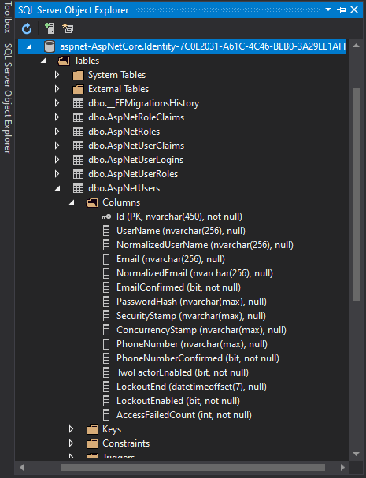

Existem diversas colunas e tabelas criadas por padrão pelo Identity, que muitas vezes não são utilizadas por uma aplicação mais simples. Mais para frente iremos falar como Customizar o Identity.

---

## Facilidades com o Identity

### Autenticação

Nossa aplicação, do jeito que está agora, possue todas as Views (Home e Privacy) "abertas" para todos acessarem, inclusive por usuários não autenticados.

Supondo que surgiu uma nova demanda - A view Privacy será aberta apenas por usuários autenticados.

Com o Identity, a implementação dessa Feature é muito simples. basta irmos na HomeController e incluirmos uma anotação [Authorize] sobre a action "Privacy".

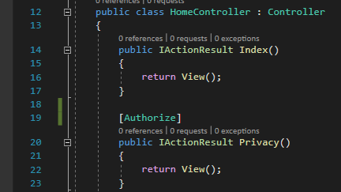

Apenas com a inclusão dessa linha de código, quando um usuário não autenticado clicar no link "Privacy" será redirecionado para a View de Login. Um usuário autenticado possue acesso a essa View.

---

### Autorização

- Tá legal, mas e se for necessários termos grupos/funções de Usuários - Ex. Admin e User?

Para trabalharmos com grupos/funções de usuários podemos usar as "Roles".

Agora nossa nova demanda é que para o Usuário conseguir acessar a View Privacy, ele precisa ser "Admin" no sistema.

Para entendermos melhor os próximos passos, vamos olhar as tabelas do nosso Banco de Dados.

Na tabela "AspNetUser" é onde estão localizados nossos usuários. Atualmente temos dois usuários registrados: "leonardo.89@uol.com.br" e "ze@gmail.com".

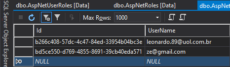

Na tabela "AspNetRoles" é onde estão as nossas Roles. Atualmente apenas com uma: "Admin".

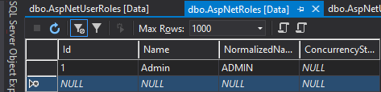

E na tabela "AspNetUserRoles" é onde fazemos a associação de usuários com as suas respectivas Roles (pode ser mais de uma). Atualmente temos uma associação do usuário "leonardo.89@uol.com.br" com a Rode "Admin" através de seus Id's.

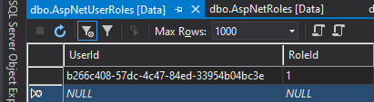

Na nossa action "Privacy" preciamos informar que elá terá acesso apenas para usuários autenticados e com a Role Admin. Para isso basta acrescentarmos na anotação a Role desejada.

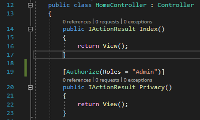

E por fim, mas não menos importante, devemos adicionar o middleware na classe startup, no método "ConfigureServices"

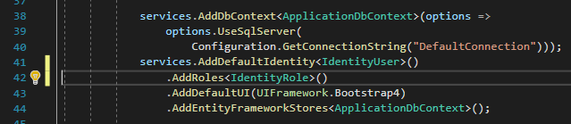

---

Ao executarmos a aplicação e o usuário "ze@gmail.com" estiver logado e tentar acessar a View Privacy, ele será redirecionado para uma tela de "Acesso Negado", pois ele não possui a Role "Admin".

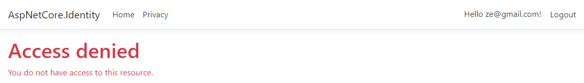

Já o usuário "leonardo.89@uol.com.br" terá total acesso a View Privacy por ter a Role "Admin".

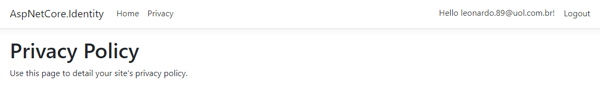

---

## Cadê as Views do Identity?

A partir do ASP.NET Core 2.1 as telas do Identity são do tipo "Razor Class Libraries". Ou seja, diferentemente das versões anteriores, não são criados as models e views no projeto.

- Então minhas telas não poderão ser traduzidas ou alteradas?

É possivel sim customizar as telas padrões do Identity.

Falaremos agora como adicionar o código-fonte das Razor Class Libraries para conseguirmos modifica-las.

---

### Importado as Razor Class Libraries

Para conseguirmos ter acesso às paginas criadas pelo Identity, temos que realizar um Scaffold.

Clicando com o botão direito do mouse sobre o projeto, selecionamos a opção "Add" > "New Scaffolded Item".

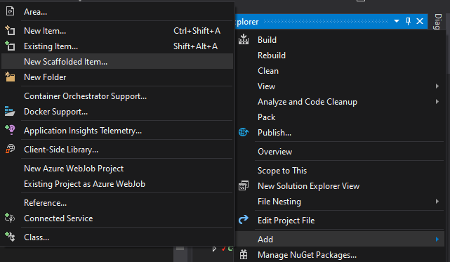

Ao clicarmos em "New Scaffolded Item" uma nova janela irá se abrir. Devemos selecionar a opção "Identity", que está localizada no lado esquerdo da Aba, e clicar no botão "Add".

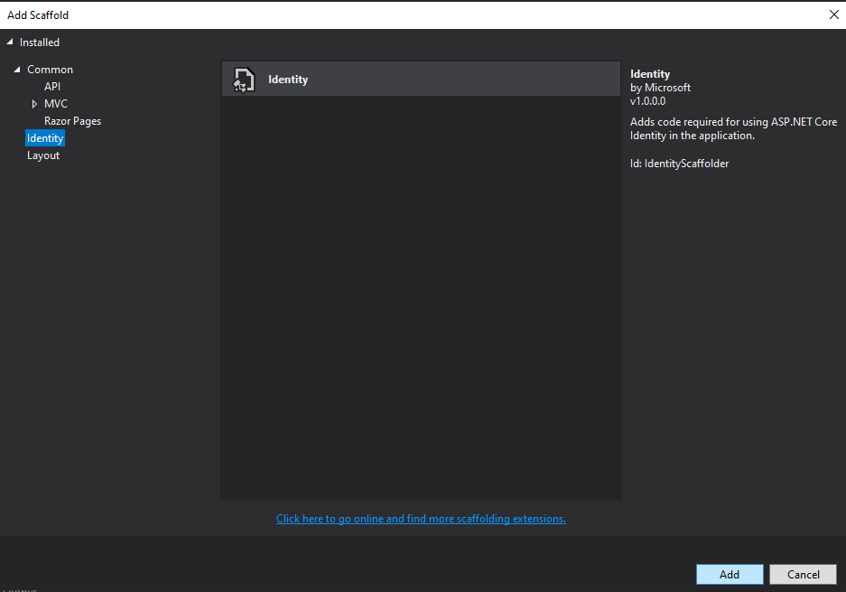

Quando clicamos no botão "Add" outra janela irá se abrir (pode demorar um pouco). Nessa janela é onde selecionamos as telas que terão os seus códigos fontes importados para o projeto, sendo assim, possível edita-los.

Selecione as telas que desejar!

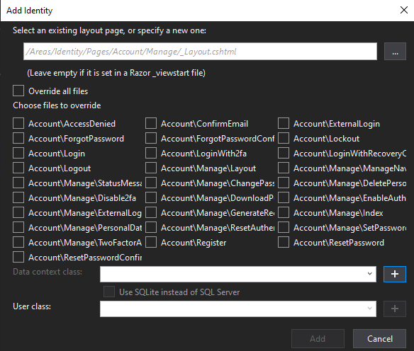

Inicialmente, como forma de exemplo, realizei o Scaffold de três "views" - "Register", "Login" e "AccessDined".

Dentro do diretório Areas/Identity/Pages/ foi criado uma nova pasta - Account. Dentro dessa pasta possuimos alguns arquivos, mas inicialmente focaremos nos arquivos "AccsessDenied.cshtml", "Login.cshtml" e "Register.cshtml".

//testar aqui exlcuindo os outros arquivos para checar a real dependencia deles para funcionalidade das views.

---

### Conhecendo as Razor Class Libraries

Se formos observar a criação das telas padrões do ASP.NET Core Identity pelo Scaffold, é um pouco diferente das "Views" que conhecemos dos projetos MVC. Não foi criado nenhuma Classe de Model e Controller para realizar o fluxo de chamadas dessas telas quando necessário.

Isso ocorre, por que como foi dito anteriormente, o Identity, a partir da versão do ASP.NET Core 2.1, trabalha com Razor Class Libraries.

O recurso "Razor Class Libraries" é algo novo no ASP.NET Core. Vamos entende-lo melhor com as Views criadas pelo Scaffold do Identity.

---

A Razor Class Libraries (RCL) permite encapsular Razor views, Paginas, Controladores, Razor Components, Views Components e Modelos de dados, podendo ser empacotados e reutilizados, como uma lib.

Inicialmente isso pode parecer um pouco confuso, mas analisando melhor, podemos observar algumas vantagens no uso das Razor Class Libraries e consecultivamente o uso das RCLs pelo Identity.

- Facilidade na compartilhamento de código (UI e Regra de negócio);
- Evitamos a repetição de códigos em diversos projetos;
- Abstração de códigos comuns;

Obs: Nós também podemos criar nossas prórpias Razor Class Libraries e reutiliza-las em nossas aplicaçãoes. Para usar uma RCL temos duas opções - Criando um pacote nuget ou Adicionando como Referência na Aplicação.

#### Analisando a Register.cshtml

A primeira coisa que notamos na Arvore do projeto é que possuimos dois arquivos relacionados a UI de Register - "Register.cshtml" que é Razor page e "Register.cshtml.cs" que é o código C#, que é basicamente a Modelo de dados da Page.

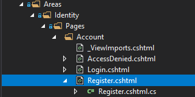

##### Register.cshtml

O código da Register.cshtml assemelha-se muito aos arquivos de exibição Razor que trabalhamos nos Projetos MVC. O que diferencia é a diretiva "@page".

A diretiva @page transforma o arquivo em uma ação do MVC, o que significa que ele trata as solicitações sem passar por um controlador.

É possvel notar a presença da diretiva "@model RegisterModel".

RegisterModel é criado dentro do arquivo "Register.cshtml.cs".

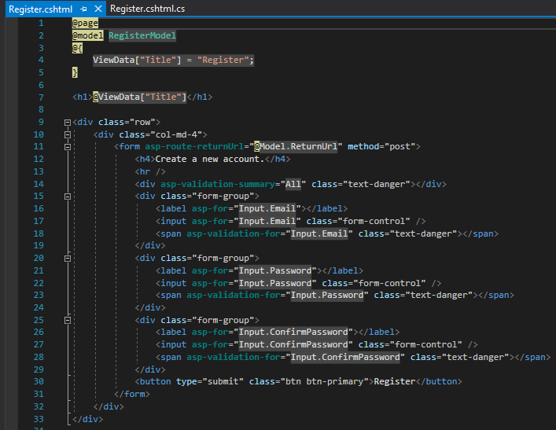

##### Register.cshtml.cs

O arquivo Register.cshtml.cs é classe modelo da Razor Page (é a classe PageModel, que nesse caso é "RegisterModel"). Por convenção possui o mesmo nome da Razor Page.

Analisando a classe RegisterModel notamos que é filha de PageModel e recebe por injeção de dependência o "SignInManager", "UserManager", "ILogger" e "IEmailSender".

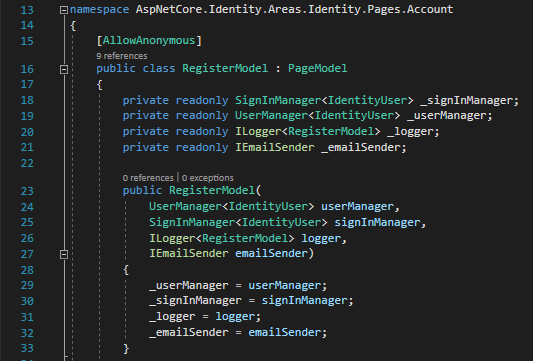

Possui duas propriedades publicas - "Input" do tipo InputModel e "ReturnUrl" do tipo string.

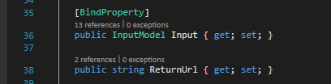

Existe uma classe representando o formulário de registro contendo as propriedades "Email", "Password" e "ConfirmPassword". Todas propriedades decoradas com Data Annotations para validação client side (assemelhando-se a uma ViewModel).

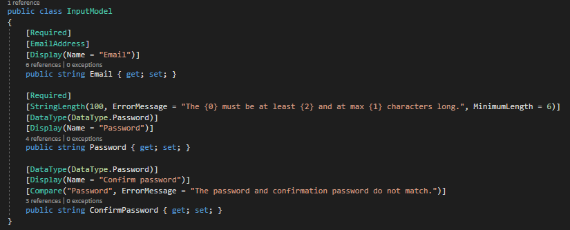

E por fim, possuis dois métodos que trabalham conforme as requisições do cliente. Temos o método "OnGet" que é executado quando o cliente envia uma requisição "Get" com a Url da razor page (/Identity/Account/Register). O Segundo método é que é executado com uma requisição do tipo "Post" - "OnPostAsync".

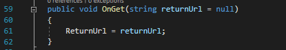

No método "OnPostAsync" é realizado as validações de usuário do Identity e caso válido, persistido no Banco de Dados. Por padrão na coluna UserName é passado o valor do email passado no formulário.

Além da validação e persistencia, é possível notarmos a geração de código relacionado a Confirmação de Email, caso a aplicação possua esse requisito.

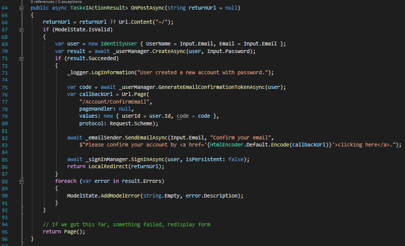
