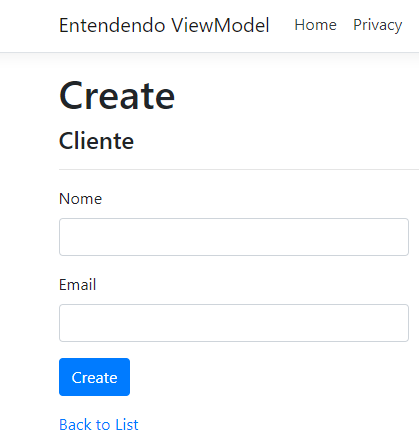
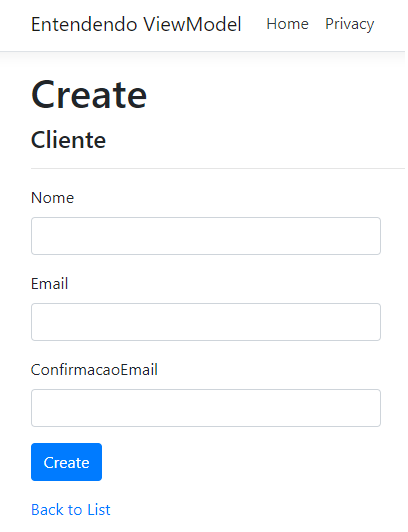

# Como criar um campo de confirmação de Email no Formulário sem alterar nossa classe de domínio

Bora descobrir como criar um campo de Confirmação de Email em um simples formulário, porém sem alterar a classe de domínio e o Banco de Dados?

Você deve estar pensando agora: Isso é muito simples, eu sei resolver de "olhos fechados".

Pode ser que sim, mas eu tenho a certeza que muitos iniciantes em programação iriam queimar a cabeça para resolver esse problema. Então, caso esse seja o seu caso, espero que esse artigo te ajude de alguma forma.

Nesse exemplo estamos utilizando como Stack o ASP.NET Core, em um projeto com o padrão arquitetural MVC. Usaremos um cenário simples para não termos distrações e focar no que é o essencial.

Mas chega de tanto blá blá blá e vamos para o que interessa… Código!

---

### Nossa View (Cenário inicial)

Como eu disse no inicio, será um cenário bem simples: Onde temos um sistema com uma tela de cadastro de "Usuário" apenas com os campos "Nome", "Email" e um botão de "submit".



Para criarmos essa Tela, temos uma View fortemente tipada, usando a "Model" de Cliente para ser renderizada.

```csharp
    @model NomeProjeto.Models.Cliente
    ...
```

Para ver o código completo da view…LINK.

---

### Nossa Model

Nosso "Usuário" foi modelado na classe "Cliente.cs" dentro da pasta "Models" contendo apenas as duas propriedades que representam os campos dos Formulários: "Nome" e "Email (mais a propriedade "Id" - Usada pelo Entity Framework).

```csharp
public class Cliente
{
   public int Id { get; set; }
   public string Nome { get; set; }
   public string Email { get; set; }
}
```

---

### Nossa Controller

E para tratarmos as requisições temos a controller "ClienteController". Focaremos apenas na Action "Create" (Post).

```csharp
[HttpPost]
[ValidateAntiForgeryToken]
public IActionResult Create(Cliente cliente)
{
   ...
}
```

Para ver o código completo da ClienteController…LINK

---

### Nova demanda: Um novo campo no Formulário para confirmação de Email

Até o momento nosso sistema de cadastro estava rodando sem problemas até que surge uma nova solicitação do cliente pedindo para criarmos um novo campo no formulário para confirmação de Email.

Essa simples alteração pode gerar muita dor de cabeça para quem está começando como programador…

> Como resolver esse problema da melhor forma possível?
>
> Devo criar uma propriedade nova na minha entidade Cliente?
>
> Faz sentido termos uma coluna de confirmação na minha tabela do Banco de Dados?

Muitas perguntas surgem na cabeça do iniciante em programação, deixando-o tenso em como resolver esse problema.

Ou em alguns casos o Desenvolvedor olha essa situação e já realiza a seguinte alteração: Criar uma nova propriedade na Model Cliente.

```csharp
public class Cliente
{
   public int Id { get; set; }
   public string Nome { get; set; }
   public string Email { get; set; }
   public string ConfirmaEmail { get; set; }
}
```

Agora paramos para pensar. Faz sentido criarmos essa nova propriedade na entidade Cliente?

Ao fazermos isso na classe Cliente, essa alteração será refletida no Banco de Dados, criando uma nova Coluna "ConfirmaEmail". E claro que isso não é o ideal.

> Tá, mas o que eu faço então????

---

### Apresento-lhes a ViewModel!

Perceba que ao colocarmos uma nova propriedade "ConfirmaEmail" em nossa classe Cliente, estamos modificando nossas classe de domínio apenas para representar algo da camada de apresentação, e isso não é bom para nosso código.

Para resolver esse "problema" usamos o padrão ViewModel.

Nem sempre queremos apresentar todo o conteúdo de uma Model na View. Muitas vezes queremos apenas uma parte dela ou um conjunto de informações de mais de uma Model.

No nosso caso, temos um campo do formulário que não deve fazer parte do nosso Domínio.

---
---

## Solucionando o problema com ViewModel

Agora que sabemos da existência do padrão ViewModel, como podemos usa-lo pra resolver nosso problema?

Criamos nossas ViewsModels guiados pela camada de Apresentação.

### Criando nossa "ClienteCadastroViewModel"

Nossa ViewModel é uma classe comum que possui as informações necessárias para serem apresentadas na View.

No nosso caso queremos representar os campos "Nome", "Email" e "ConfirmaEmail".

```csharp
public class ClienteCadastroViewModel
{
   public string Nome { get; set; }
   public string Email { get; set; }
   public string ConfirmaEmail { get; set; }
}
```

### Adaptando a view para ser do Tipo "ClienteCadastroViewModel"

Antes nossa View Create era do tipo "Cliente", agora temos que mudar para o tipo da nossa ViewModel - "ClienteCadastroViewModel".

```csharp
@model NomeProjeto.ViewModels.ClienteCadastroViewModel
...
```

Também temos que criar o novo campo de formulário na nossa View. Irei criar com TagHelpers do Razor.

```csharp
<div class="form-group">
<label asp-for="ConfirmacaoEmail" class="control-label"></label><input asp-for="ConfirmacaoEmail" class="form-control" />
<span asp-validation-for="ConfirmacaoEmail" class="text-danger"></span>
</div>
```

Para ver o código completo da view…LINK

### Nossa ClienteController também precisa ser refatorada

Nossa action "create" (post) recebia como argumento uma Model de "Cliente". Agora temos que modificar para nossa ViewModel "ClienteCadastroViewModel".

```csharp
[HttpPost]
[ValidateAntiForgeryToken]
public IActionResult Create(ClienteCadastroViewModel clienteVM)
{
   ...
}
```

A action Create, nesse exemplo, é responsável por gravar no Bando de Dados o que foi recebido como argumento (Obs.: Não é o ideal a Controller acessar o Banco de Dados. Estou fazendo dessa forma para simplificar o código).

O Banco espera receber uma Model de Cliente, porém estamos recebendo uma ViewModel "ClienteCadastroViewModel". Temos que fazer uma "conversão" da ViewModel recebida para uma Model de Cliente.

```csharp
[HttpPost]
[ValidateAntiForgeryToken]
public IActionResult Create(ClienteCadastroViewModel clienteVM)
{
   var cliente = new Cliente
   {
      Nome = clienteVM.Nome,
      Email = clienteVM.Email
   };
   ...
}
```

Após essa conversão, a gravação no banco de dados continua igual ao nosso ponto de partida, quando recebíamos uma Model de Cliente no argumento do Action.

Para ver o código completo da ClienteController…LINK

---

## Conclusão

No inicio da nossa trajetória como desenvolvedores nos deparamos com algumas situações que são corriqueiras e simples para os "devs" mais experientes, mas para quem está iniciando não é tão simples assim. Isso devido a não termos experiencia em como "codar direito" e a falta de conhecimento dos tão falados "patterns" de desenvolvimento.

Nesse primeiro artigo foi visto o Padrão ViewModel. Um "pattern" utilizado em diversos projetos, mas que confunde muito quem está iniciando.

Foi utilizado um cenário bem simples para passar o conceito, mas vale lembrar que não restringimos o uso das ViewModels apenas para casos como o que falamos nesse artigo.

Enfim, vimos que com a utilização da ViewModel, conseguimos ter uma tela de cadastro de clientes com confirmação de Email sem alterar nossa classe de Domínio.

